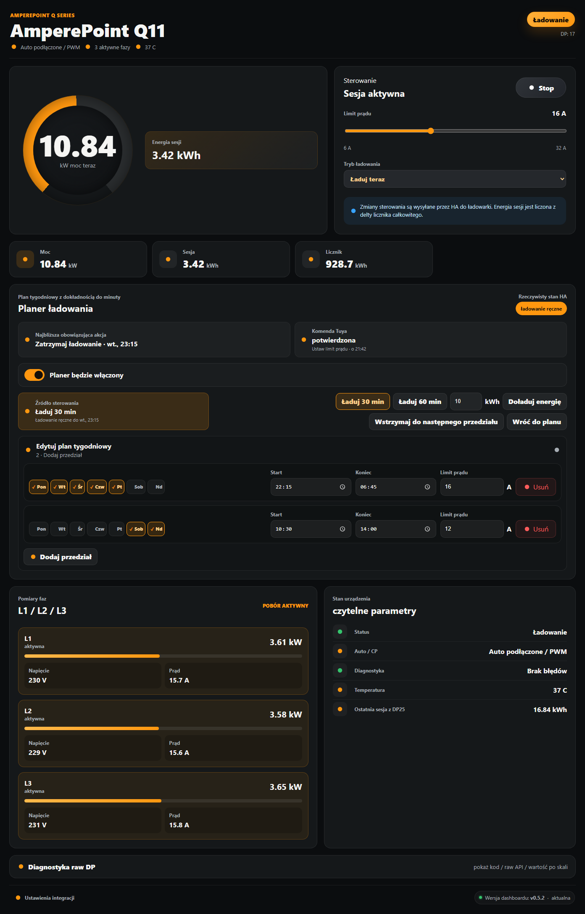
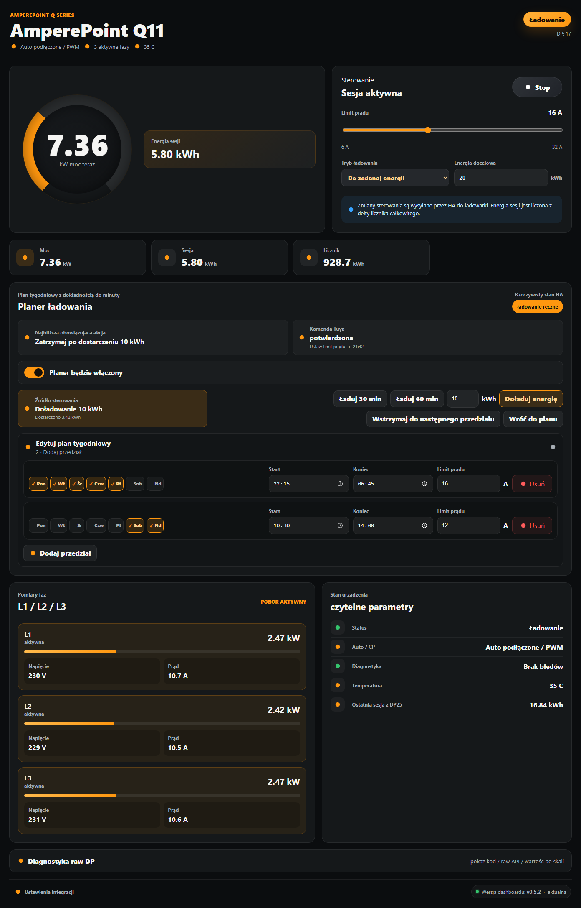
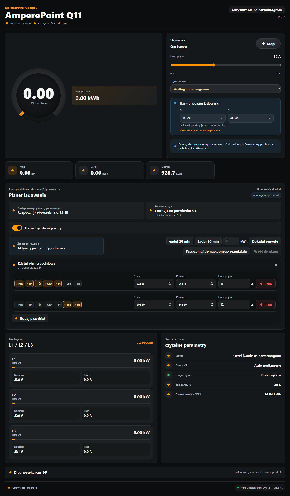
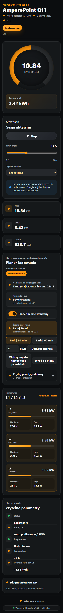

# TuyaExtend AmperePoint

Home Assistant / HACS workspace for AmperePoint EV chargers using Tuya.

<p align="center">
  <a href="https://my.home-assistant.io/redirect/hacs_repository/?owner=amperepoint&repository=tuyaextend-amperepoint&category=integration">
    
  </a>
</p>

## Manuals

- [English installation manual](INSTALL.en.md)
- [Polska instrukcja instalacji](INSTALL.pl.md)

## Quick Start

1. Add the charger to the Tuya Smart / Smart Life app.
2. Configure the official Home Assistant Tuya integration first.
3. Install this repository through HACS as a custom integration.
4. Restart Home Assistant. This is required after every first HACS installation.
5. Add `AmperePoint` from Home Assistant integrations.
6. Choose automatic setup and select the detected charger. The integration
   creates one shared `AmperePoint` sidebar panel and adopts the remaining
   detected chargers automatically; every charger is available from the
   device selector on the panel.

Full installation manuals: [`INSTALL.en.md`](INSTALL.en.md) / [`INSTALL.pl.md`](INSTALL.pl.md).

## Dashboard previews

The values below are simulated, but the images are rendered from the bundled
Home Assistant card itself.

### Charge now



### Charge to an energy target



### Scheduled charging



### Basic planner (v0.5)



The built-in planner is independent of the charger's single Tuya `local_timer`
window. It supports multiple weekly intervals with minute precision and a
separate current limit for every interval. Overlapping and back-to-back
intervals are merged into one continuous charging block, so charging is not
interrupted where intervals meet; while intervals overlap, the higher-priority
interval decides the current limit. Manual controls can charge for 30 or
60 minutes, add a selected amount of energy, pause until the next interval or
return to the weekly plan.

Planner commands are applied in a safe sequence (charge-now mode, current
limit, start/stop) and remain pending until the reported Tuya state confirms
them. The plan, manual override and command state are stored by Home Assistant,
and an enabled plan is evaluated again after every restart. The planner is
disabled by default and starts controlling the charger only after the user
saves it as enabled.

This repository contains:

- the HACS integration in [`custom_components/tuyaextend_amperepoint`](custom_components/tuyaextend_amperepoint),
- the bundled Lovelace card in [`custom_components/tuyaextend_amperepoint/frontend`](custom_components/tuyaextend_amperepoint/frontend),
- the AmperePoint EVSE knowledge pack in [`amperepoint/`](amperepoint/).

The AmperePoint pack includes `tuya-local` profiles, Lovelace dashboards,
diagnostic scripts, sanitized API dumps and DP maps collected from real Q Series
chargers.

## AmperePoint Pack

Start here:

```text
amperepoint/README.md
```

Important files:

```text
TODO.md
amperepoint/profiles/tuya_local/
amperepoint/dashboards/
amperepoint/docs/
amperepoint/observations/
amperepoint/scripts/
custom_components/tuyaextend_amperepoint/
```

## HACS Integration Direction

`TuyaExtend AmperePoint` is a charger-specific extension layer. It can use either
the official Tuya integration directly or entities supplied by Xtend Tuya,
`tuya-local` or LocalTuya. Xtend Tuya is optional; it is not required for the
AmperePoint dashboard or the additional charger DPS.

The recommended flow is:

1. Install and configure the official Home Assistant Tuya integration.
2. Install this repository as a HACS custom integration.
3. Restart Home Assistant so the newly downloaded Python integration can load.
4. Add `AmperePoint` from Home Assistant integrations.
5. Use the welcome flow to select a detected charger or map entities manually.
6. Open the shared `AmperePoint` sidebar dashboard and choose a charger from
   the selector. Additional detected chargers are adopted automatically.

During an upgrade, only unchanged per-charger dashboards generated by older
versions are replaced by the shared panel. A legacy dashboard with user edits
is preserved.

The integration detects AmperePoint Q Series models from the Tuya device name,
model and product identifiers. The model key is encoded in the product/device
metadata, so current-limit ranges and phase assumptions are selected
automatically.

With the official Tuya source, the integration reads the charger's complete
runtime DP status and definitions instead of relying only on the small subset of
entities created by Home Assistant. It creates normalized HA entities for status,
charging state, power, energy, current limit, charging mode, target energy,
temperature, diagnostics and phase measurements when valid payloads are
available. The raw-DP view lists every DP received from the charger and marks
writable values. Start/stop, current limit, charging mode and target energy are
sent through the official Tuya runtime when their DPS are writable.

When an Xtend Tuya or local source is selected, existing entity mapping remains
available as a compatibility adapter. Missing datapoints do not break the
dashboard; the frontend card hides unavailable sections.

The bundled card is exposed from the integration directory and registered as a
Lovelace module resource automatically in storage-mode dashboards. If Lovelace is
configured in YAML mode, add the resource manually:

```yaml
url: /tuyaextend_amperepoint/frontend/amperepoint-q22-card.js
type: module
```

With more than one AmperePoint charger configured, the card header shows a
charger selector, so one panel can switch between devices. Alternatively pass
`entityPrefix` or explicit `entities` to pin a card to one charger.
For example:

```yaml
type: custom:amperepoint-q22-card
entityPrefix: amperepoint_q22_ota
```

## Current Findings

### Q22 OTA / `cu111poj2mtikvls`

Current test pairing:

```text
Device ID: <device_id_q22_ota_current>
Local IP: <local_ip_q22_ota_current>
Local protocol: 3.5
Product ID: cu111poj2mtikvls
```

An earlier 2026-06-11 Tuya Sharing API capture exposed:

```text
DP1  forward_energy_total
DP3  work_state
DP4  charge_cur_set
DP9  power_total
DP13 connection_state
DP14 work_mode
DP17 energy_charge
DP18 switch
DP24 temp_current
DP25 charge_energy_once
```

The following DPS were defined in the product but were absent from that earlier
capture:

```text
DP6  phase_a
DP7  phase_b
DP8  phase_c
DP10 fault
DP19 local_timer
DP23 system_version
DP33 mode_set
```

Switching the Tuya Developer project from Standard Instruction to DP Instruction
did not make those missing report-only DPS appear in the HA/Tuya Sharing API
response.

On 2026-07-14, Home Assistant 2026.7.2 held all 17 Q11 runtime DPS in the
official Tuya device manager, even though its device page exposed only the
charging switch. TuyaExtend AmperePoint 0.3 reads that supported runtime data
directly. The tested device provided DP1, 3, 4, 6, 7, 8, 9, 10, 13, 14, 17, 18,
19, 23, 24, 25 and 33. All-zero phase payloads remain hidden until physically
plausible phase data is reported.

### Q37 / EV Charger VE / `fdfjiphjxtc9qyhd`

For the tested Q37 generation:

- DP1 behaves as a resetting session counter, not a lifetime meter.
- DP25 latches the completed/last session value.
- DP6/DP7/DP8 produced invalid local phase values on the tested unit and are not
  mapped as production sensors.

### Older Q Series / `bktb3jskdic1ar2t`

The older test charger exposed local DP6/DP7/DP8 phase payloads. This confirms
that phase DPS exist in at least some Q Series generations, but behavior differs
by firmware/product generation.

## Security

This repository must not contain:

- Tuya local keys,
- Tuya access tokens,
- Home Assistant `.storage` files,
- account credentials.

API dumps under `amperepoint/observations/` are sanitized.

## Installation Notes

This repository does not replace Tuya account pairing. It adds an AmperePoint
normalization and DP-extension layer on top of an existing official Tuya, Xtend
Tuya, `tuya-local` or LocalTuya source.

Recommended direction:

1. Use the official Tuya integration for the simplest cloud setup; Xtend Tuya is
   optional and remains supported as an entity source.
2. Use `tuya-local` with profiles from `amperepoint/profiles/tuya_local/` for LAN
   testing.
3. Use the AmperePoint extension integration from:

```text
custom_components/tuyaextend_amperepoint/
```

That extension normalizes charger data into EVSE-oriented entities and, with the
official Tuya adapter, exposes additional runtime DPS that the core Tuya UI may
not create as entities.
